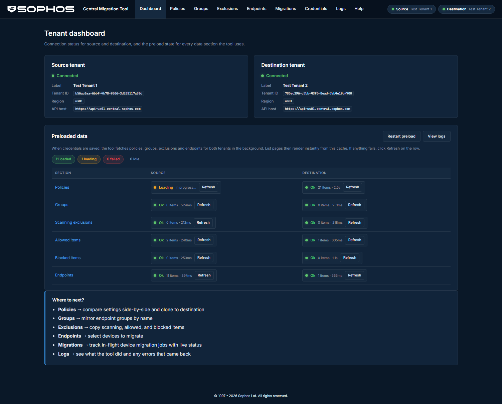

# Sophos Central Migration Tool

A locally-run web tool for migrating configuration and devices between two Sophos Central tenants.

Connects to a **source** and **destination** tenant via the official Sophos Central APIs, provides a side-by-side view of policies, groups, exclusions, and endpoints, and lets you migrate selected items in a controlled, auditable way — including the actual two-tenant device migration flow with live progress tracking.



## Features

### Credential modes

The tool supports two ways to connect:

- **Direct tenant mode** — enter a separate Client ID and Client Secret for the source and destination tenants. Create these in each tenant under *Global Settings > API Credentials*.
- **Partner / organization mode** — enter a single set of partner or organization API credentials that manage multiple tenants. The tool loads the full tenant list and lets you pick source and destination from a dropdown. Includes a **Partner Explorer** page for browsing all managed tenants and searching for endpoints across every tenant.

A first-run welcome wizard walks you through either mode, tests the connection before saving, and stores everything in a local `.env` file.

### Configuration comparison and migration

- **Endpoint policies** — listed by product type (Threat Protection, Web Control, Peripheral Control, etc.) with source and destination side-by-side. Per-policy deep-match badges show whether settings are identical, how many differences exist, or whether a policy only exists on one side. Click **Compare** for a full side-by-side settings table grouped by top-level key, with status pills (match / differs / source only / dest only) and a toggle between "differences only" and "all settings". Clone individual policies or bulk-select and clone to destination. Delete policies from the destination tenant with double confirmation.
- **Endpoint groups + user groups** — tabbed view separating endpoint groups (`/endpoint/v1/endpoint-groups`) and user/directory groups (`/common/v1/directory/user-groups`). Source-vs-destination side-by-side with badges for groups that only exist on one side. Mirror selected groups to destination (name and metadata only — membership is not transferred; devices reconstitute group membership after migration). Delete from destination.
- **Scanning exclusions, allowed items, blocked items** — tabbed view with source-vs-destination tables per category. Select individual items or use Select All, then copy to destination. Duplicate detection prevents creating items that already exist on the dest side. Delete from destination.
- **Dry-run mode** on every migration action — preview exactly what would be created, overwritten, or skipped without touching the destination.
- **"Hide fully matching products" toggle** on the policies page — runs a background deep-match analysis (fetching full settings for every paired policy) and only shows products with actual differences. Uses a server-side cache invalidated on credential or policy changes.

### Device migration

- **Bidirectional** — migrate devices from source to destination, or from destination back to source (in case you move a machine by mistake).
- **Both tenants visible** — the endpoints page shows source and destination devices side-by-side with hostname, OS, health, IP, associated user, and relative "last seen" timestamps.
- **14-day window enforcement** — devices that haven't checked in within 14 days are flagged as "stale" and cannot be selected for migration. A global toggle lets you hide stale devices entirely. The server also runs a preflight check and rejects any stale endpoints before creating jobs.
- **Select All** — select all eligible (non-stale) devices on either side, respecting the current hostname filter.
- **Endpoint detail modal** — click Detail on any device to see the full Sophos API response: ID, type, OS version, is-server flag, health breakdown (threats + services + individual service details), IPv4/IPv6/MAC addresses, associated person, tamper protection, isolation, lockdown, group, assigned products with versions and status, and last seen.
- **Two-tenant migration flow** — uses the official `/endpoint/v1/migrations` API. The tool creates a receiver job on the target tenant (with `fromTenant` + `endpoints`), then a sender job on the source tenant (with `fromTenant` + `endpoints` + the handshake `token`). Both sides are polled every 10 seconds via Server-Sent Events, and per-device status is shown live in the browser.
- **Migration job history** — all jobs are persisted to `data/migration-jobs.json` so you can reopen a job detail page after a browser refresh or server restart. Cancel any in-flight job (deletes both upstream Sophos jobs with double confirmation).

### Partner Explorer

Available when using partner or organization credentials:

- **Tenant list** — browse all managed tenants with name, tenant ID, region, and geography. Filter by name. Sortable columns.
- **Global endpoint search** — search by hostname across every managed tenant in one query (5-concurrent fan-out). Results show which tenant each device belongs to, with "source" / "dest" / "other" badges.
- **Tenant drill-down** — click Explore on any tenant to open a detail panel where you can search endpoints within that specific tenant.

### Observability

- **Dashboard** — shows connection status for both tenants (label, tenant ID, region, API host) and a preload status grid. After credentials are saved, the server preloads policies, groups, exclusions, and endpoints for both sides in the background. The grid shows per-section status (loaded / loading / failed / idle), item counts, and duration. Per-row Refresh buttons let you retry failed sections. A "Restart preload" button re-fetches everything.
- **Logs page** — in-memory ring buffer (last 500 entries) with timestamp, level, section, side, and message. Filter by section (preload, state, credentials, compare, migration), side (source / dest), level (info / warn / error), or free-text search. Auto-refreshes every 4 seconds with a toggle. Sortable columns.
- **Audit log** — every mutation against either tenant is recorded as a JSON line in `data/audit.log` with a unique ID, timestamp, side, tenant ID, action, resource type, resource ID, success/failure, and detail payload.

### UI

- Dark theme matching the Sophos Central dashboard (Inter font, navy gradient background, white Sophos logo).
- Sticky top navigation with tenant status pills showing the friendly label (or short tenant ID). Partner Explorer link only appears in partner mode.
- Sortable table columns on every page — click any column header to sort ascending, click again to reverse.
- Selection baskets with bulk actions (clone, mirror, copy, migrate).
- Toast notifications for success/error feedback.
- All pages are plain HTML + ES modules — no React, no build step for the frontend. Edit a file, refresh the browser.

## Prerequisites

- **Node.js 20** or newer
- **Sophos Central API credentials** — either:
  - **Direct tenant mode**: a Client ID + Client Secret created in each tenant under *Global Settings > API Credentials* (Super Admin role recommended)
  - **Partner mode**: a single partner or organization API credential set that manages both tenants
- For device migration: ensure **Device Migration is enabled** on the destination tenant in *Global Settings > Device Migration*

## Quick start

```bash
git clone https://github.com/Aaronjacobs000/sophos-central-migration-tool.git
cd sophos-central-migration-tool
npm install
npm start
```

Open http://127.0.0.1:3100 in your browser. The welcome wizard will guide you through entering credentials (direct or partner mode), testing the connection, and saving the configuration.

To use a different port:

```bash
PORT=3200 npm start
```

## How device migration works

The Sophos device migration API (`/endpoint/v1/migrations`) uses a two-tenant handshake:

1. **Receiver job** — created on the target tenant with `name`, `fromTenant` (the other tenant's UUID), and `endpoints` (the device UUIDs to migrate). The response includes a handshake `token`.
2. **Sender job** — created on the source tenant with `name`, `fromTenant` (the target tenant's UUID), `endpoints` (same device UUIDs), and `token` (from the receiver response).
3. **Polling** — the tool polls both sides every 10 seconds and pushes status updates to the browser via Server-Sent Events. Per-device status transitions through `pending` → `migrating` → `completed` (or `failed`).
4. **14-day window** — devices must check in with Sophos within 14 days for the migration to land. The tool enforces this at selection time (greying out stale devices) and at preflight (rejecting them server-side before creating jobs).

The tool handles both directions (source→dest and dest→source) for cases where you need to move a device back.

## Project layout

```
backend/
  src/
    server.ts                    # Express entry point, route mounting, static serving
    state.ts                     # AppState singleton, dual-mode (direct/partner) context management
    log.ts                       # Ring-buffer logger with secret masking
    config/
      env-file.ts                # Atomic .env read/write preserving comments
      validate.ts                # Credential extraction, masking, mode detection
    sophos/
      constants.ts               # Sophos auth URL + global API base URL
      tenant-context.ts          # createDirectContext, createPartnerContext, partnerSideContext
      auth/token-manager.ts      # OAuth2 client credentials + auto-refresh (from sophos-central-mcp)
      client/
        sophos-client.ts         # HTTP client with retry, rate-limit, region routing (from sophos-central-mcp)
        tenant-resolver.ts       # /whoami + tenant list + regional host cache (from sophos-central-mcp)
      types/
        sophos.ts                # Sophos API response types (from sophos-central-mcp)
        migration.ts             # Policy, group, exclusion, migration job types
      api/
        policies.ts              # /endpoint/v1/policies wrappers
        groups.ts                # /endpoint/v1/endpoint-groups wrappers
        user-groups.ts           # /common/v1/directory/user-groups wrappers
        exclusions.ts            # Scanning exclusions + allowed/blocked items wrappers
        endpoints.ts             # /endpoint/v1/endpoints (list, get, pagination)
        migrations.ts            # /endpoint/v1/migrations (receiver + sender + polling)
    routes/                      # Express route modules
    services/                    # Business logic (policy-migrator, group-mirror, device-migrator, etc.)
    compare/
      json-diff.ts               # Structural deep-diff engine (~100 lines, no deps)
    middleware/                   # requireConfigured, sideParam, errorHandler

frontend/                        # Vanilla HTML + ES modules, no build step
  welcome.html                   # First-run wizard (mode picker, credential entry, tenant selector)
  index.html                     # Dashboard with preload status grid
  policies.html                  # Product-grouped policy comparison
  policy-compare.html            # Side-by-side settings diff table
  policy-detail.html             # Single policy viewer
  groups.html                    # Endpoint groups + user groups (tabbed)
  exclusions.html                # Scanning / allowed / blocked (tabbed)
  endpoints.html                 # Source + dest devices, bidirectional selection
  migrate.html                   # Migration review + dry-run + launch
  migrate-jobs.html              # Job history
  migrate-job-detail.html        # Live SSE status
  partner-explorer.html          # Tenant list + global endpoint search (partner mode)
  search.html                    # Standalone endpoint search
  credentials.html               # Mode toggle + credential editor
  logs.html                      # Ring-buffer log viewer with filters
  help.html                      # Prerequisites, workflow, caveats
  css/base.css                   # Dark Sophos Central theme tokens
  css/components.css             # All component styles
  js/                            # One module per page + shared utilities

data/                            # gitignored, created at runtime
  migration-jobs.json            # Local migration job state
  audit.log                      # Append-only mutation log

.env                             # gitignored, managed by the UI
.env.example                     # Committed template with all supported keys
```

## Security

- The server binds to **127.0.0.1 only** — it is not reachable from the network.
- Credentials are stored in **plain text** in `.env` at the repo root. Run only on a trusted workstation with full-disk encryption. Do not commit, back up, or sync `.env` to cloud drives. `.gitignore` excludes it.
- Secrets are **never returned** by the API. The credentials page shows masked values until you click Reveal.
- Every migration action supports **dry-run** mode that returns the exact planned API calls without touching the destination.
- Every mutation is recorded to `data/audit.log` with timestamp, request ID, side, tenant ID, resource, and result.
- **Destructive actions** (delete policy/group/exclusion, overwrite policy, cancel migration) require explicit double confirmation.

## Credits

Core Sophos Central API client code (OAuth2 token manager, HTTP client with retry/rate-limiting, tenant resolver with regional routing) is vendored from [sophos-central-mcp](https://github.com/Aaronjacobs000/sophos-central-mcp) (MIT License). See [ATTRIBUTIONS.md](ATTRIBUTIONS.md) for details.

## License

MIT. See [LICENSE](LICENSE).
