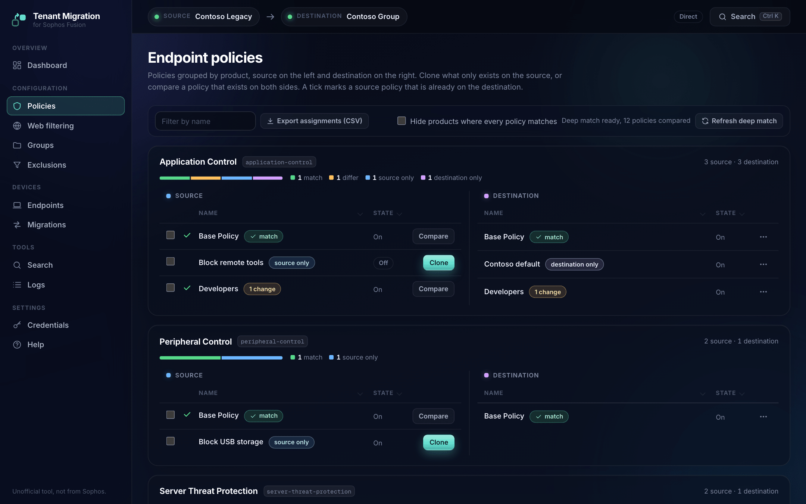
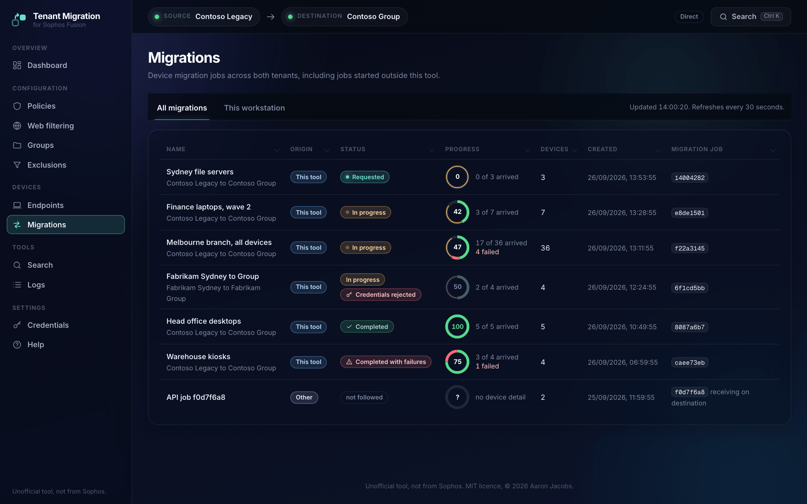
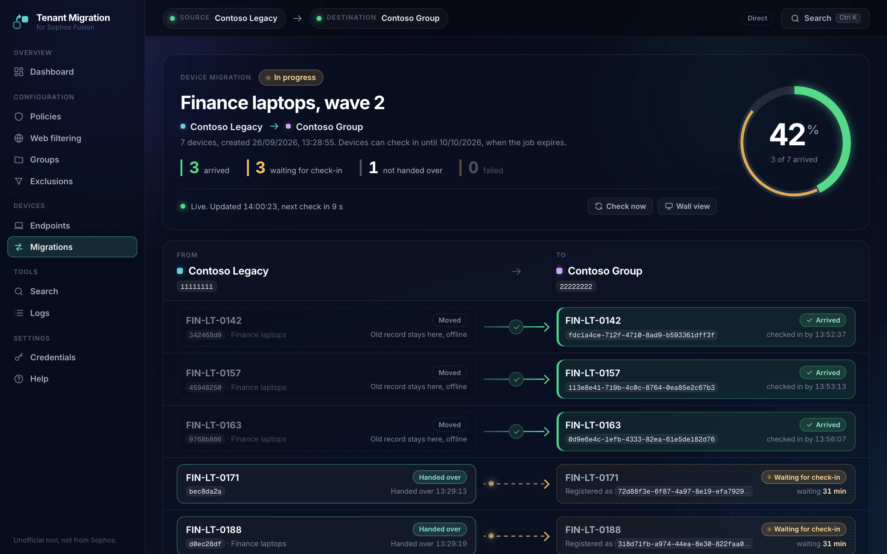
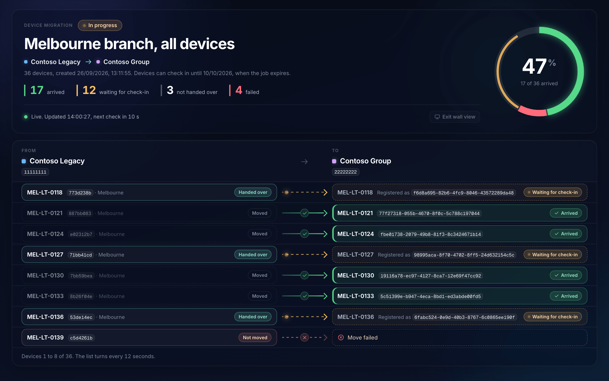

# Sophos Fusion Tenant Migration Tool (formerly Sophos Central)

> **Unofficial project, not from Sophos.** This is a personal project by an individual. It is
> not an official Sophos product and it is not built, endorsed, supported, or warranted by
> Sophos. It calls the public Sophos APIs using credentials you supply. Use it at your own
> risk, and raise problems as issues on this repository rather than with Sophos support.

A locally run web tool for moving configuration and devices between two Sophos Fusion (formerly Sophos Central) tenants.

It connects to a source and a destination tenant through the public Sophos Fusion APIs, shows policies, groups, exclusions, web filtering and devices side by side, and moves the items you pick. Exclusion and web filtering copies and device migrations can be previewed with a dry run first, and every write is recorded in an audit log. Device moves use the two-tenant migration flow and show each device's progress live.


## Features

### Connecting

There are two ways to connect:

- Direct tenant mode: a Client ID and Client Secret for each tenant, created under *Global Settings > API Credentials*.
- Partner or organization mode: one partner or organization credential that manages both tenants. The tool loads the tenant list and you pick the source and destination. The Partner Explorer page lists every managed tenant and searches for devices across all of them.

A first-run wizard walks through either mode, tests the connection before saving, and stores the result in a local `.env` file.

### Policies

Endpoint policies are grouped by product, source on the left and destination on the right. A deep match reads the full settings of every policy that exists on both sides, and each product shows a small bar of how many policies match, differ, or exist on one side only. You can hide products where everything matches.



Compare opens one table of settings grouped by section, with readable labels (the raw setting key shows when you hover a row). A tick marks a source policy that is already on the destination. Clone copies a source-only policy to the bottom of the destination's priority order, just above the base policy, and ends with a list of each policy marked created, already there, or failed, with notes on settings changed to fit. Compare offers to overwrite a destination policy with the source version. Destination policies can be deleted from a row menu after a double confirmation.

Policy assignments cannot be migrated because the public API rejects every `appliesTo` write. Export assignments (CSV) lists them so you can reassign them by hand.

When a web control policy points at a web filtering profile, the clone maps the profile ID to the destination profile with the same name. If the destination has no such profile, the policy is not cloned and the result names the profile to copy first, because Sophos refuses a web control policy without its profile. The deep match and Compare show the profile by name, so a correct clone matches.

A Linux runtime detection policy points at a detection profile by ID and version. The clone maps it to the destination profile with the same name, at that profile's latest version, because each tenant numbers its own versions. The tool does not copy these profiles: if the destination has no profile of that name, the policy is not cloned and the result names the profile to create there first. The deep match and Compare show the profile by name, and a version that is the profile's latest as "latest".

Sophos accepts at most 1000 applications in each application control list (controlled and allowed) through its API, and every write replaces the whole list, so a longer list can't be sent in parts. A policy over the limit is not cloned or overwritten, and the result gives the count.

### Web filtering

Site lists and web filtering profiles copy to the destination. Copy site lists first: a profile refers to site lists by ID, and the copy maps each one to the destination list with the same name. Profile links to policies are not copied; cloning the web control policy makes the link. A copy ends with a list of what was created, with notes on anything that was mapped or left out. A tick marks a source list or profile that is already on the destination. Destination site lists and profiles can be deleted from a row menu to undo a copy, after a preview and a double confirmation; each delete is audited.

### Groups

Endpoint groups and user groups mirror to the destination by name and description. A group already on the destination, matched by name in any case, is skipped, and a tick marks it on the source side. A mirror ends with a list of every group marked created, already there, or failed. Members are not copied, because source device IDs mean nothing on the destination. After a device move, the job page can add each moved device to the destination group with the same name as its source group, so policies assigned to that group follow it.

### Exclusions and lists

Eight global lists copy with the same duplicate check: scanning exclusions, allowed items, blocked items, isolation exclusions, intrusion prevention exclusions, custom exploit mitigation applications, Website Management entries, and websites excluded from TLS decryption. A copy ends with a list of every item marked created, already there, or failed. Rows that exist on both sides are dimmed, and a tick marks a source item that is already on the destination. Copy the Website Management entries before cloning web control policies, because those policies refer to their tags.

### Device migration

- Moves devices from source to destination, or back again if something moved by mistake.
- Shows both tenants' devices with OS, health, IP, user and last-seen time. Devices that have not checked in for 14 days are marked stale and cannot be selected, and the server checks the window again before it creates a job.
- Before you start, the Start migration page reads the Device Migration setting on both tenants and says whether it is on, when it ends, or whether it closes within a day. Both tenants must allow migration, so the tool creates no job, and a dry run does not pass, while either one has it off or expired.
- It also reads both tenants' licences, compares the destination's free seats with the selected computers and servers, and flags products the source has that the destination lacks (endpoint and server protection, XDR, MDR, Device Encryption). Product names map loosely to features, so this warns and never blocks.
- A dry run shows the calls the real run would make, and the groups the selected devices are in.
- Each job has the name you give it when you start it. The Migrations page shows the name with the route under it, and the job page uses it as its title.
- Sophos reports a device moved within seconds, but the device only arrives when it next checks in to the receiving tenant, under a new ID (about 24 minutes in testing). So a job's status follows the devices' check-ins:
  - Requested: Sophos has accepted the job and no device has checked in to the receiving tenant yet.
  - In progress: at least one device has checked in.
  - Completed: every device has checked in.
  - Completed with failures: every device has either checked in or failed, and at least one failed. Failed: none checked in.
  - A device fails only when Sophos reports it failed, or when the job expires (14 days after it was created) before the device checked in. A device that is still waiting, such as a laptop that is switched off, stays waiting and shows how long it has waited.
- Clicking a job opens a monitor: the sending tenant on the left, the receiving tenant on the right, and a row per device showing whether it has moved, with its new ID and check-in time once it arrives. A progress ring shows the share of devices that have arrived, and the Migrations page shows a small version of it next to each job.
- The monitor refreshes itself and can be left open: it checks every 10 seconds during the handover and every 30 seconds while devices wait to check in, slows to every 5 minutes while the job's credentials are refused, and stops once the job has finished. It shows when it last checked and when it checks next, and reconnects on its own if the tool restarts. *Wall view* hides the menus, scales the page to the screen and pages through the devices when they don't all fit. The Migrations page refreshes every 30 seconds.
- Each job records the tenants it ran against and stores its own credentials, encrypted (see [Security](#security)), so it keeps checking the right tenants after the tool is pointed at another pair. If Sophos later refuses those credentials, for example because they were deleted in Sophos Fusion, the job page and the Migrations page say "credentials rejected", keep showing the last known state with the time of the last successful check, and offer to attach new credentials. A failed check never replaces what the job last saw.
- Jobs started with earlier builds of the tool have no stored credentials. The job page says so and can attach the tool's current connection, or entered tenant credentials, after checking that both tenants know the job.
- Some jobs recorded their tenants by ID only and show "Tenant" and the start of the ID. The tool fills in the name when it can match the tenant ID to the tool's current connection (its label, or the partner's tenant list) or to another job. That happens when credentials are attached, when the job is next checked, and when the Migrations page loads. A recorded name is never changed.
- The Migrations page merges jobs from both tenants' APIs with the ones started here, so moves started in the Sophos Fusion console or from another workstation show too.
- Jobs are kept in `data/migration-jobs.json`, so a job page still opens after a browser refresh or a server restart.
- A started migration can't be cancelled. The Sophos migrations API has no cancel or delete (DELETE answered 404 on 25/09/2026), so the tool has no Cancel button. A receiving job that the sending tenant never picks up stays listed until it expires, 14 days after it was created.

The Migrations page, a job's monitor, and the same monitor in wall view:







### Around the tool

- The dashboard shows the route, a four-step checklist (connect, configuration, devices, verify) with live counts, and the preload state of each data section with a refresh button per tenant.
- Ctrl K opens a palette for going to any page or finding a device by hostname.
- The Logs page shows the last 500 server log lines with filters. Copies, clones, deletes and migrations are also written to `data/audit.log`.

## Prerequisites

- Node.js 20 or newer.
- Sophos Fusion (formerly Sophos Central) API credentials, either:
  - a Client ID and Client Secret created in each tenant under *Global Settings > API Credentials* (Super Admin role recommended), or
  - one partner or organization credential that manages both tenants.
- For device moves, Device Migration turned on in both tenants under *Global Settings > Device Migration*.

## Quick start

```bash
git clone https://github.com/Aaronjacobs000/sophos-tenant-migration-tool.git
cd sophos-tenant-migration-tool
npm install
npm start
```

Open http://127.0.0.1:3100. The welcome wizard asks for credentials, tests them and saves them.

To use a different port:

```bash
PORT=3200 npm start
```

To run the tests (they use a fake Sophos API and never touch a tenant):

```bash
npm test
```

## How device migration works

The Sophos device migration API (`/endpoint/v1/migrations`) uses a two-tenant handshake:

1. Pre-flight: Device Migration must be on in both tenants' Sophos Fusion consoles (*Overview > Global Settings > Device Migration*). The tool reads it with `GET /endpoint/v1/settings/migration` on each, shows the result before you start, and creates no job while either is off. A receiving tenant accepts a receiver job whatever the sending tenant's setting, and that job cannot be deleted through the API, so the check runs first.
2. Receiver job: `POST /endpoint/v1/migrations` on the receiving tenant with `fromTenant` (the sending tenant's ID) and `endpoints` (the device IDs). The response has the job `id` and a handshake `token`.
3. Sender trigger: `PUT /endpoint/v1/migrations/{jobId}` on the sending tenant with the same job ID, the `token` and the `endpoints`. This starts the move; it does not create a second job.
4. Polling: both sides are checked every 10 seconds while Sophos hands devices over and every 30 seconds while they wait to check in, and the browser gets the updates as server-sent events. Each device goes from `pending` to `succeeded` or `failed`. The job's overall status comes from the device results, because the API does not fill in a job-level status.
5. Group membership: `GET /endpoint/v1/migrations/{jobId}/endpoints` returns each moved device's `newId`. The job page adds the new IDs to the destination groups named like the devices' source groups with `POST /endpoint/v1/endpoint-groups/{id}/endpoints`. The source groups are recorded when the job is created. The sending tenant keeps listing the device's old record, offline, after each move in either direction. The re-add matches by the device's group name on the sending tenant, so a device that was in no group there can't be put back in a group automatically.
6. Check-in: `succeeded` means Sophos has handed the device over and registered it on the receiving tenant under its `newId`, offline, with `lastSeenAt` equal to `registeredAt`. The device arrives when it next checks in. The tool reads the new records with `GET /endpoint/v1/endpoints?ids=...` and counts a device as checked in once `lastSeenAt` passes `registeredAt` by more than a minute. It matches by ID, never by hostname, because the receiving tenant can hold older records with the same hostname.
7. The 14-day window: devices must check in within 14 days for the move to land. The tool blocks stale devices when you select them and again before it creates the jobs.

The tool works in both directions, source to destination and back.

## Project layout

```
backend/
  src/
    server.ts                    # Express entry point, route mounting, static files
    state.ts                     # App state, direct and partner mode contexts
    log.ts                       # Ring-buffer logger with secret masking
    config/                      # .env read and write, credential checks and masking
    sophos/
      constants.ts               # Sophos auth URL and global API host
      tenant-context.ts          # Direct and partner tenant contexts
      auth/token-manager.ts      # OAuth2 client credentials and refresh (from sophos-mcp)
      client/
        sophos-client.ts         # HTTP client with retry, rate limits, region routing (from sophos-mcp)
        tenant-resolver.ts       # /whoami, tenant list, regional host cache (from sophos-mcp)
      types/                     # API response types
      api/                       # One wrapper per API: policies, groups, exclusions,
                                 # endpoints, migrations, web filters, runtime detection
                                 # profiles, licences, settings
    routes/                      # Express routes
    services/                    # Policy, group, exclusion and web filter copies, device
                                 # migration, group membership, pre-flight and licence checks
    compare/json-diff.ts         # Small structural diff
    compare/policy-pairing.ts    # Pairs source and destination policies by type and name
    middleware/                  # requireConfigured, sideParam, JSON-only guards, errorHandler

frontend/                        # Plain HTML and ES modules, no build step
  *.html                         # One page per screen
  css/base.css                   # Design tokens; the accent is one variable, --accent
  css/components.css             # Shell, cards, tables, tags and page styles
  js/                            # One module per page, plus nav, icons and shared helpers
  fonts/                         # Inter and Geist Mono, with their licences

test/                            # node:test suites against a fake Sophos API

docs/                            # README screenshots (made against the fake API)

data/                            # Created at run time, not committed
  migration-jobs.json            # Local migration jobs
  migration-jobs.auto-backup.json # Copy saved with each job save, to recover a damaged jobs file
  job-credentials.json           # Each job's credentials, encrypted (key kept outside the repo)
  job-credentials.auto-backup.json # Copy saved with each credential save, to recover a damaged file
  audit.log                      # Copies, clones, deletes and migrations

.env                             # Not committed, managed by the UI
.env.example                     # Template with every supported key
```

## Security

- The server listens on **127.0.0.1 only**, so it is not reachable from the network.
- The tool has no sign-in of its own. Anyone who can reach it can use it, which means acting with the credentials in `.env` and the ones stored with jobs. Everyone who uses one copy shares its connection and its jobs, and the audit log does not record who made a change.
- To share it with a team, run it on a server behind your own sign-in, for example a reverse proxy with single sign-on on the same server that forwards to `127.0.0.1:3100`. The listen address is set in `backend/src/server.ts`, so listening on any other address is a code change today.
- Changes need a JSON request, or a PUT, PATCH or DELETE, which a browser sends to 127.0.0.1 for another site only after a CORS preflight that the server never answers. So a page on another site can't make a change by posting a form. Adding moved devices to groups also needs `dryRun` set to `true` or `false`.
- Credentials are stored in **plain text** in `.env` at the repo root. Run the tool only on a trusted workstation with full-disk encryption, and do not commit, back up or sync `.env` to cloud drives. `.gitignore` excludes it.
- The API never returns secrets. The credentials page shows masked values.
- A device move's handshake token is used once, for the sender trigger. It is not saved in `data/migration-jobs.json`, and the Logs page, `/api/logs` and error messages mask it.
- Each migration job stores the credentials it needs to check its progress later, so it keeps working after the tool is pointed at other tenants:
  - They are encrypted with AES-256-GCM in `data/job-credentials.json`, with a copy in `data/job-credentials.auto-backup.json` (both mode 0600). There is one entry per API credential, shared by every job that used it, and jobs refer to it by an opaque ID.
  - The 256-bit key is created on first use in `~/.sophos-tenant-migration-tool/job-credentials.key` (mode 0600, in a 0700 folder), outside the repo, so copying, syncing or sharing the repo or `data/` does not expose a secret. On Windows that is `%USERPROFILE%\.sophos-tenant-migration-tool\job-credentials.key`. Set `JOB_CREDENTIALS_KEY_FILE` to keep the key somewhere else.
  - No route returns them, and the job page and `/api/migrate/devices/jobs` only say whether they are stored. They are masked in logs and error messages.
  - Limits: anyone who can read both the key and `data/` as your user can decrypt them, the same trust as the plain-text `.env`. On Windows the file modes are not enforced, so rely on the user profile's own permissions. If the key is lost (another computer, or the file deleted), jobs say their credentials can't be read, and you can attach them again.
  - The job page has *Remove stored credentials*. Use it once a job has finished; an entry no job uses is deleted. The tool's own `.env` is not changed.
  - They are stored rather than read from `.env` because `.env` holds only the pair the tool points at now, so a reference into it would break, or point at the wrong tenants, as soon as the tool is repointed.
- Exclusion and web filtering copies, device migrations and group membership can be run as a dry run first from the page, which returns what would be created or changed without touching the destination. The API accepts `dryRun` on policy and group copies too.
- Every write to a tenant, from the pages or straight through the API (copies, clones, creates, updates, deletes and migrations), is recorded in `data/audit.log` with a timestamp, ID, side, tenant ID, resource and result, including writes Sophos refuses. If an entry can't be written, for example because OneDrive or antivirus held the file past the retries, the write's own result still shows, with a warning, and the entry goes to the Logs page.
- Deleting a policy, group or exclusion asks for confirmation twice. Overwriting a policy asks once.

## Credits

The core Sophos API client code (OAuth2 token manager, HTTP client with retry and rate limiting, tenant resolver with regional routing) is vendored from [sophos-mcp](https://github.com/Aaronjacobs000/sophos-mcp) (formerly sophos-central-mcp, MIT License). The Inter and Geist Mono fonts are bundled under the SIL Open Font License. See [ATTRIBUTIONS.md](ATTRIBUTIONS.md).

## License

MIT. See [LICENSE](LICENSE).
