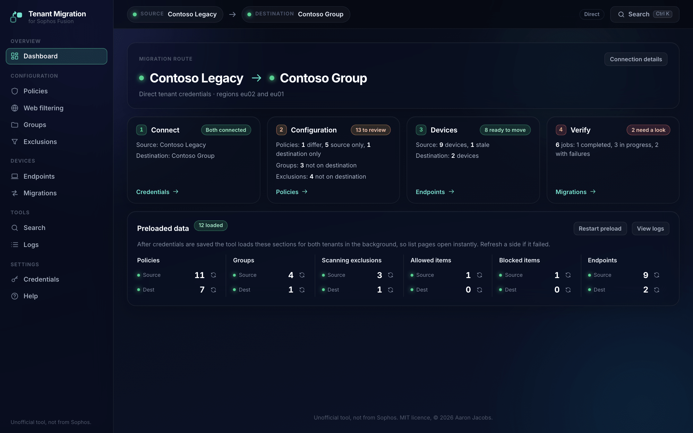

# Sophos Fusion Tenant Migration Tool (formerly Sophos Central)

> **Unofficial project, not from Sophos.** This is a personal project by an individual. It is
> not an official Sophos product and it is not built, endorsed, supported, or warranted by
> Sophos. It calls the public Sophos APIs using credentials you supply. Use it at your own
> risk, and raise problems as issues on this repository rather than with Sophos support.

A locally run web tool for moving configuration and devices between two Sophos Fusion (formerly Sophos Central) tenants.

It connects to a source and a destination tenant through the public Sophos Fusion APIs, shows policies, groups, exclusions, web filtering and devices side by side, and moves the items you pick. Copies and migrations can be previewed with a dry run first, and they are recorded in an audit log. Device moves use the two-tenant migration flow and show each device's progress live.



## Features

### Connecting

There are two ways to connect:

- Direct tenant mode: a Client ID and Client Secret for each tenant, created under *Global Settings > API Credentials*.
- Partner or organization mode: one partner or organization credential that manages both tenants. The tool loads the tenant list and you pick the source and destination. The Partner Explorer page lists every managed tenant and searches for devices across all of them.

A first-run wizard walks through either mode, tests the connection before saving, and stores the result in a local `.env` file.

### Policies

Endpoint policies are grouped by product, source on the left and destination on the right. A deep match reads the full settings of every policy that exists on both sides, and each product shows a small bar of how many policies match, differ, or exist on one side only. You can hide products where everything matches.

Compare opens one table of settings grouped by section, with readable labels (the raw setting key shows when you hover a row). Clone copies a source-only policy to the bottom of the destination's priority order, just above the base policy, and Compare offers to overwrite a destination policy with the source version. Destination policies can be deleted from a row menu after a double confirmation.

Policy assignments cannot be migrated because the public API rejects every `appliesTo` write. Export assignments (CSV) lists them so you can reassign them by hand.

When a web control policy points at a web filtering profile, the clone maps the profile ID to the destination profile with the same name. If the destination has no such profile, the setting is dropped and the result says so.

### Web filtering

Site lists and web filtering profiles copy to the destination. Copy site lists first: a profile refers to site lists by ID, and the copy maps each one to the destination list with the same name. Profile links to policies are not copied; cloning the web control policy makes the link. Destination site lists and profiles can be deleted from a row menu to undo a copy, after a preview and a double confirmation; each delete is audited.

### Groups

Endpoint groups and user groups mirror to the destination by name and description. Members are not copied, because source device IDs mean nothing on the destination. After a device move, the job page can add each moved device to the destination group with the same name as its source group, so policies assigned to that group follow it.

### Exclusions and lists

Eight global lists copy with the same duplicate check: scanning exclusions, allowed items, blocked items, isolation exclusions, intrusion prevention exclusions, custom exploit mitigation applications, Website Management entries, and websites excluded from TLS decryption. Rows that already exist on both sides are dimmed. Copy the Website Management entries before cloning web control policies, because those policies refer to their tags.

### Device migration

- Moves devices from source to destination, or back again if something moved by mistake.
- Shows both tenants' devices with OS, health, IP, user and last-seen time. Devices that have not checked in for 14 days are marked stale and cannot be selected, and the server checks the window again before it creates a job.
- Before you start, the Start migration page reads the Device Migration setting on both tenants and says whether it is on, when it ends, or whether it closes within a day. Both tenants must allow migration, so the tool creates no job, and a dry run does not pass, while either one has it off or expired.
- It also reads both tenants' licences, compares the destination's free seats with the selected computers and servers, and flags products the source has that the destination lacks (endpoint and server protection, XDR, MDR, Device Encryption). Product names map loosely to features, so this warns and never blocks.
- A dry run shows the calls the real run would make, and the groups the selected devices are in.
- The job page follows both sides through a server-sent event stream, with a progress bar and a row per device.
- Sophos reports a device moved within seconds, but the device only arrives when it next checks in to the receiving tenant, under a new ID (about 24 minutes in testing). The job page shows each device as waiting for check-in until then, with its new ID, and keeps following the job until every device has checked in.
- The Migrations page merges jobs from both tenants' APIs with the ones started here, so moves started in the Sophos Fusion console or from another workstation show too.
- Jobs are kept in `data/migration-jobs.json`, so a job page still opens after a browser refresh or a server restart.
- A started migration can't be cancelled. The Sophos migrations API has no cancel or delete (DELETE answered 404 on 25/09/2026), so the tool has no Cancel button. A receiving job that the sending tenant never picks up stays listed until it expires, 14 days after it was created.

### Around the tool

- The dashboard shows the route, a four-step checklist (connect, configuration, devices, verify) with live counts, and the preload state of each data section with a refresh button per tenant.
- Ctrl K opens a palette for going to any page or finding a device by hostname.
- The Logs page shows the last 500 server log lines with filters. Copies, clones and migrations are also written to `data/audit.log`.

## Prerequisites

- Node.js 20 or newer.
- Sophos Fusion (formerly Sophos Central) API credentials, either:
  - a Client ID and Client Secret created in each tenant under *Global Settings > API Credentials* (Super Admin role recommended), or
  - one partner or organization credential that manages both tenants.
- For device moves, Device Migration turned on in both tenants under *Global Settings > Device Migration*.

## Quick start

```bash
git clone https://github.com/Aaronjacobs000/sophos-tenant-migration-tool.git
cd sophos-tenant-migration-tool
npm install
npm start
```

Open http://127.0.0.1:3100. The welcome wizard asks for credentials, tests them and saves them.

To use a different port:

```bash
PORT=3200 npm start
```

To run the tests (they use a fake Sophos API and never touch a tenant):

```bash
npm test
```

## How device migration works

The Sophos device migration API (`/endpoint/v1/migrations`) uses a two-tenant handshake:

1. Pre-flight: Device Migration must be on in both tenants' Sophos Fusion consoles (*Overview > Global Settings > Device Migration*). The tool reads it with `GET /endpoint/v1/settings/migration` on each, shows the result before you start, and creates no job while either is off. A receiving tenant accepts a receiver job whatever the sending tenant's setting, and that job cannot be deleted through the API, so the check runs first.
2. Receiver job: `POST /endpoint/v1/migrations` on the receiving tenant with `fromTenant` (the sending tenant's ID) and `endpoints` (the device IDs). The response has the job `id` and a handshake `token`.
3. Sender trigger: `PUT /endpoint/v1/migrations/{jobId}` on the sending tenant with the same job ID, the `token` and the `endpoints`. This starts the move; it does not create a second job.
4. Polling: both sides are polled every 10 seconds and the browser gets the updates as server-sent events. Each device goes from `pending` to `succeeded` or `failed`. The job's overall status comes from the device results, because the API does not fill in a job-level status.
5. Group membership: `GET /endpoint/v1/migrations/{jobId}/endpoints` returns each moved device's `newId`. The job page adds the new IDs to the destination groups named like the devices' source groups with `POST /endpoint/v1/endpoint-groups/{id}/endpoints`. The source groups are recorded when the job is created, because the sending tenant stops listing a device once it has moved.
6. Check-in: `succeeded` means Sophos has handed the device over and registered it on the receiving tenant under its `newId`, offline, with `lastSeenAt` equal to `registeredAt`. The device arrives when it next checks in. The tool reads the new records with `GET /endpoint/v1/endpoints?ids=...` and counts a device as checked in once `lastSeenAt` passes `registeredAt` by more than a minute. It matches by ID, never by hostname, because the receiving tenant can hold older records with the same hostname.
7. The 14-day window: devices must check in within 14 days for the move to land. The tool blocks stale devices when you select them and again before it creates the jobs.

The tool works in both directions, source to destination and back.

## Project layout

```
backend/
  src/
    server.ts                    # Express entry point, route mounting, static files
    state.ts                     # App state, direct and partner mode contexts
    log.ts                       # Ring-buffer logger with secret masking
    config/                      # .env read and write, credential checks and masking
    sophos/
      constants.ts               # Sophos auth URL and global API host
      tenant-context.ts          # Direct and partner tenant contexts
      auth/token-manager.ts      # OAuth2 client credentials and refresh (from sophos-mcp)
      client/
        sophos-client.ts         # HTTP client with retry, rate limits, region routing (from sophos-mcp)
        tenant-resolver.ts       # /whoami, tenant list, regional host cache (from sophos-mcp)
      types/                     # API response types
      api/                       # One wrapper per API: policies, groups, exclusions,
                                 # endpoints, migrations, web filters, licences, settings
    routes/                      # Express routes
    services/                    # Policy, group, exclusion and web filter copies, device
                                 # migration, group membership, pre-flight and licence checks
    compare/json-diff.ts         # Small structural diff
    middleware/                  # requireConfigured, sideParam, errorHandler

frontend/                        # Plain HTML and ES modules, no build step
  *.html                         # One page per screen
  css/base.css                   # Design tokens; the accent is one variable, --accent
  css/components.css             # Shell, cards, tables, tags and page styles
  js/                            # One module per page, plus nav, icons and shared helpers
  fonts/                         # Inter and Geist Mono, with their licences

test/                            # node:test suites against a fake Sophos API

data/                            # Created at run time, not committed
  migration-jobs.json            # Local migration jobs
  audit.log                      # Copies, clones and migrations

.env                             # Not committed, managed by the UI
.env.example                     # Template with every supported key
```

## Security

- The server listens on **127.0.0.1 only**, so it is not reachable from the network.
- Credentials are stored in **plain text** in `.env` at the repo root. Run the tool only on a trusted workstation with full-disk encryption, and do not commit, back up or sync `.env` to cloud drives. `.gitignore` excludes it.
- The API never returns secrets. The credentials page shows masked values.
- A device move's handshake token is used once, for the sender trigger. It is not saved in `data/migration-jobs.json`, and the Logs page, `/api/logs` and error messages mask it.
- Copies and migrations can be run as a dry run first, which returns what would be created or changed without touching the destination.
- Copies, clones and migrations are recorded in `data/audit.log` with a timestamp, ID, side, tenant ID, resource and result.
- Deleting a policy, group or exclusion asks for confirmation twice. Overwriting a policy asks once.

## Credits

The core Sophos API client code (OAuth2 token manager, HTTP client with retry and rate limiting, tenant resolver with regional routing) is vendored from [sophos-mcp](https://github.com/Aaronjacobs000/sophos-mcp) (formerly sophos-central-mcp, MIT License). The Inter and Geist Mono fonts are bundled under the SIL Open Font License. See [ATTRIBUTIONS.md](ATTRIBUTIONS.md).

## License

MIT. See [LICENSE](LICENSE).
